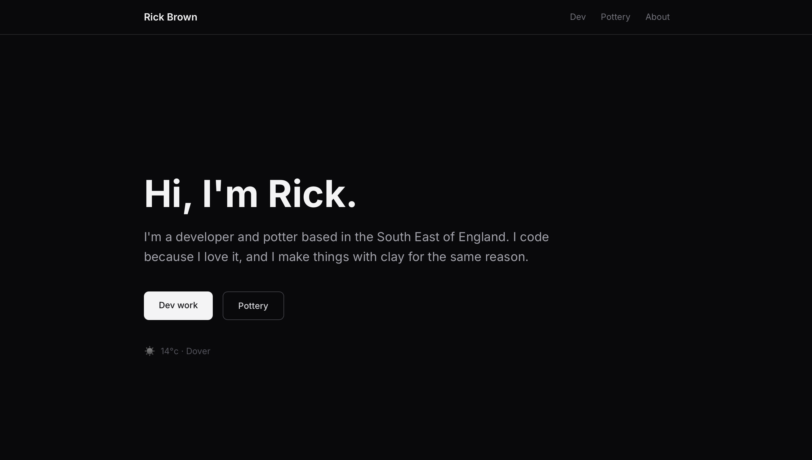

# rickbrown.co.uk



Personal site for Rick Brown — developer and potter based in the South East of England.

## Stack

- [Next.js 15](https://nextjs.org/) — App Router
- [TypeScript](https://www.typescriptlang.org/)
- [Tailwind CSS](https://tailwindcss.com/)
- [OpenWeather API](https://openweathermap.org/api) — geolocation weather widget

## Running locally

```bash
npm install
npm run dev
```

Open [http://localhost:3000](http://localhost:3000).

## Environment variables

Create a `.env.local` file in the root:

```
OPENWEATHER_API_KEY=your_key_here
```

Get a free API key at [openweathermap.org](https://openweathermap.org/api).

## Pottery images

Drop images into `public/pottery/` and update `data/pottery.ts` with the filenames.

## Deployment

Deployed on [Vercel](https://vercel.com). Add `OPENWEATHER_API_KEY` to your Vercel project environment variables.
